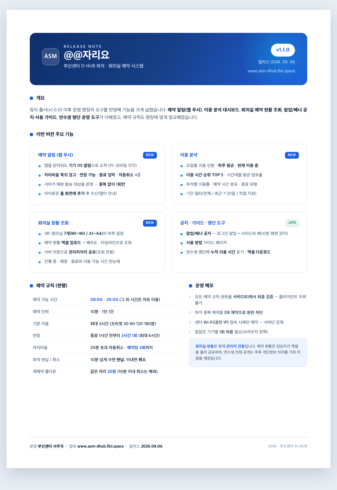

# 부산센터 D-HUB 좌석 예약 (@@자리요)

48석 개발공간(D-HUB)을 예약제로 운영하는 웹앱. PC / 모바일 반응형.
좌석 예약·자리비움·연장 같은 기본 흐름부터, 관리자 운영 도구(명단·신고·공지·이용 분석·회의실 현황)와
예약 알림(웹 푸시)까지 갖췄다.

배포: **[www.asm-dhub.fkii.space](https://www.asm-dhub.fkii.space)** (Vercel + Supabase)

## 릴리스 노트 · v1.1.0

<p align="center">
  
</p>

> 원본 HTML: [`docs/release-note-v1.1.0.html`](docs/release-note-v1.1.0.html) — 브라우저에서 열어 인쇄(PDF 저장)할 수 있습니다.
> 이전 버전: [v1.0.0](docs/release-note.html)

## 주요 기능

**연수생**

- **좌석 예약** — "지금부터 몇 분" 방식. **30분·1시간·2시간·3시간 프리셋** + 10분 단위 조절
- **연장 / 자리 변경 / 자리비움·복귀**
- **좌석 반납 · 예약 취소** — 10분 넘게 쓰고 그만두면 "좌석 반납"(정상 이용), 10분 이내면 "예약 취소"
- **웹 푸시 알림** — 자리비움 복귀 경고·연장 가능·종료 임박·자동취소. 앱을 닫아둬도 기기 알림으로 옴
- **사용 방법** — 연수생용 가이드 페이지(`/guide`)
- **신고** — 자리 이용 / 시설 고장 / 기타

**관리자** (`profile.is_admin = true`)

- **관리자 페이지**(`/admin`) — 좌석 점검 잠금, 연수생 명단(**누적 이용 시간** 표기 · **엑셀 다운로드**), 신고 처리, 권한, 좌석 이용 이력
- **이용 분석**(`/stats`) — 요일별 이용 인원·현재 이용 중·하루 평균, **이용 시간 TOP 5**, 시간대별 평균 점유율, 좌석별 이용률, 예약 시간 분포, 종료 유형 (전체/최근 7·30일/직접 기간)
- **회의실 현황**(`/rooms`) — 회의실 예약 현황 엑셀을 관리자페이지에서 올리면 18F 회의실 7개(M1~M3 / A1~A4)의 하루 일정을 배치도·타임라인으로 조회. 조회 전용이고, 서버에 저장해 **관리자끼리 공유**된다
- **팝업/배너 공지**(`/announcement`) — 로그인 후 뜨는 **팝업 공지** + PC 사이드바 하단 **이미지 배너**를 한 화면에서 관리(옛 `/banner`는 이리로 통합)

## 예약 규칙

| 항목 | 값 |
| --- | --- |
| 운영 | 24시간 개방 · **예약은 08–20시만** (그 외 시간은 예약 없이 자율 이용) |
| 좌석 | 48석 · 3블록 × 2줄 × 8열 (창가 → 출입문) |
| 예약 시작 | **지금부터** — 센터에 와서 예약하는 방식 (미래 시각 예약 없음) |
| 예약 오픈 유예 | 07:30–08:00 사이 예약 시 시작 시각을 08:00으로 당겨 준다 |
| 기본 예약 | 최대 3시간 (프리셋 30·60·120·180분) |
| 연장 | 종료 1시간 전부터, 최대 3시간, **1회만** |
| 한 예약의 최대 길이 | 6시간 (3 + 3). 이후엔 새로 예약 |
| 시간 단위 | 10분 |
| 동시 보유 | 1인 1건 |
| 자리 변경 | 이용 시간은 그대로 두고 **자리만 이동** |
| 자리비움 | 20분 안에 복귀하지 않으면 예약 자동 취소. **예약당 최대 2회**까지 |
| 재예약 쿨다운 | **같은 자리는 종료·반납·자동취소 후 20분간 재예약 불가** (10분 이내 취소는 예외). 다른 자리는 즉시 |

규칙은 **전부 DB에 있다.** 앱 코드는 화면을 그릴 뿐이고, 최종 판정은 PostgreSQL이 한다.
`src/lib/policy.ts`의 상수는 화면 표시용 사본이므로, 값을 바꾸면 `supabase/migrations/`의
`policy` 스키마(0001, 0006, 0011, 0012, 0014, 0015, 0021, 0022, 0025 …)도 함께 바꿔야 한다.

## 알림 (웹 푸시)

앱을 닫아둬도 **기기 OS 알림**으로 도착한다. PC에서 허용하면 PC로, 폰에서 허용하면 폰으로 온다.

| 알림 | 트리거 |
| --- | --- |
| 자리비움 복귀 경고 | 자리비움 **15분** 경과 (자동취소 5분 전) |
| 연장 가능 | 예약 **종료 1시간 전** (연장 창 열림, 미연장) |
| 종료 임박 | 예약 **종료 10분 전** |
| 자동취소됨 | 자리비움 20분 초과로 취소된 순간 |

- 각 이벤트는 `notif_log`로 **1회만** 발송(중복 방지). 만료된 구독은 발송 시 자동 정리한다.
- 매분 **pg_cron → `/api/push/run`**(시크릿 헤더로 보호)이 발송 대상을 계산(`claim_due_push_events()`)해 보낸다.
- 화면엔 알림 목록/메뉴가 없다 — 기기 알림만. 권한은 첫 접속 시 브라우저 팝업으로 자동 요청(별도 버튼 없음).
- **아이폰**은 사파리 일반 탭에서 불가 — "홈 화면에 추가"(PWA 설치, iOS 16.4+) 후에만 받는다(앱이 자동 안내).

## 가입 · 접근 제어

| 항목 | 값 |
| --- | --- |
| 로그인 | Google OAuth |
| 가입 통제 | 온보딩의 (팀·이름)을 **연수생 명단(`roster`)과 대조**해야 가입. 명단은 공백·대소문자 무시 매칭 |
| 1인 1계정 | 한 명단 항목은 한 계정에만 연결 → 같은 사람이 다른 구글 계정으로 재가입 불가 |
| 사무국 예외 | 팀명을 **`사무국`**으로 입력하면 명단 없이 가입 (관리자 권한은 자동 부여 안 함) |
| 접속 제한 | `CENTER_IPS`가 설정되면 **센터 와이파이(공인 IP)에서만 예약 가능**. 외부 접속 시 버튼 차단 (서버에서도 강제) |

## 기술 스택

- Next.js 16 (App Router) / React 19 / TypeScript
- Tailwind CSS v4
- Supabase (PostgreSQL + Auth + Realtime + Storage + pg_cron)
- 웹 푸시: Service Worker(`public/sw.js`) + [`web-push`](https://www.npmjs.com/package/web-push) (VAPID)
- 엑셀(.xls/.xlsx): [SheetJS `xlsx`](https://sheetjs.com) — 연수생 명단 내려받기·회의실 예약 현황 파싱(브라우저에서)

## 설정

### 1. Supabase 프로젝트

1. [supabase.com](https://supabase.com)에서 프로젝트 생성 (region은 `Northeast Asia (Seoul)` 권장)
2. SQL Editor에서 `supabase/migrations/`의 파일을 **번호 순서대로**(0001 → 0036) 붙여넣고 실행
3. **연수생 명단 적재** — `roster(team, name)`에 명단을 넣는다(예: `supabase/dev/roster_seed.sql`).
   명단이 비어 있으면 신규 가입이 전부 막히므로 마이그레이션 직후 바로 넣는다.
4. Settings > API에서 값을 복사해 `.env.local` 작성 (아래)

### 2. 환경 변수 (`.env.local` / 배포 시 Vercel)

```bash
# 필수
NEXT_PUBLIC_SUPABASE_URL=https://xxxx.supabase.co
NEXT_PUBLIC_SUPABASE_ANON_KEY=sb_publishable_...

# 센터 와이파이 제한을 켤 때만 (센터 공인 IP를 콤마로 구분, 비우면 제한 꺼짐)
CENTER_IPS=115.22.60.18

# 웹 푸시 알림을 켤 때만 (아래 3번 참고)
NEXT_PUBLIC_VAPID_PUBLIC_KEY=B...      # 공개키(브라우저 노출 OK)
VAPID_PRIVATE_KEY=...                  # 서버 전용
VAPID_SUBJECT=mailto:you@example.com   # 푸시 제공자에 밝히는 운영자 연락처
PUSH_RUN_SECRET=...                    # /api/push/run 보호용 랜덤 시크릿
SUPABASE_SERVICE_ROLE_KEY=...          # 서버 전용(발송 라우트에서만). 절대 NEXT_PUBLIC 금지
```

- `SUPABASE_SERVICE_ROLE_KEY`는 **서버 라우트(`/api/push/run`)에서만** 쓰며 RLS를 우회한다.
  브라우저로 새어나가면 RLS가 통째로 무력화되니 **절대 `NEXT_PUBLIC_`을 붙이거나 클라이언트로 내보내지 않는다.**
- `CENTER_IPS`·`VAPID_PRIVATE_KEY`·`PUSH_RUN_SECRET`도 서버 전용(비공개). 배포(Vercel)에선
  환경 변수로 넣고 **저장 후 재배포**해야 반영된다. `NEXT_PUBLIC_*` 값은 빌드 시점에 심어지므로 특히 재배포 필수.

### 3. 로그인 방식

Google OAuth (`signInWithOAuth`)를 쓴다. Supabase 대시보드에서:

- Authentication > Providers에서 **Google** 활성화 + OAuth 클라이언트 등록
- Authentication > URL Configuration의 Redirect URLs에 배포 도메인과 `http://localhost:3000/**` 추가

### 4. 자리비움 자동 취소 (선택, 운영 권장)

앱이 열려 있으면 클라이언트가 자리비움 20분 초과 예약을 스스로 취소한다. 앱을 닫아버린
경우까지 확실히 처리하려면 서버에서 주기적으로 쓸어야 한다.

- Database > Extensions에서 `pg_cron` 활성화
- `0012_away_autocancel.sql` 실행 후, SQL Editor에서:

```sql
select cron.schedule('cancel-stale-away', '* * * * *', $$ select cancel_stale_away() $$);
```

### 5. 웹 푸시 알림 (선택)

1. VAPID 키 생성 → 위 환경 변수에 넣는다.
   ```bash
   npx web-push generate-vapid-keys
   ```
2. `0033_web_push.sql` 실행 (구독 테이블 + 발송 판정 함수).
3. Extensions에서 `pg_cron`·`pg_net` 활성화 후, 매분 발송 트리거 등록:
   ```sql
   create extension if not exists pg_net;
   select cron.schedule('push-run', '* * * * *', $$
     select net.http_post(
       url := 'https://<배포도메인>/api/push/run',
       headers := jsonb_build_object(
         'content-type','application/json',
         'x-cron-secret','<PUSH_RUN_SECRET 값>'
       ),
       body := '{}'::jsonb
     );
   $$);
   ```
4. 확인: 시크릿 헤더를 넣어 `POST /api/push/run` → `{"events":N,"sent":M}`면 정상.

### 6. 팝업/배너 공지

팝업 공지와 배너 공지는 **한 메뉴(`/announcement`, "팝업/배너 공지")로 통합**돼 있다(옛 `/banner`는 리다이렉트).

- **팝업 공지** — `0024_announcement.sql`. 로그인 후 예약 화면에서 팝업으로 표시.
- **배너 공지** — `0032_sidebar_banner.sql`이 `banners` 스토리지 버킷 + `banner` 테이블을 만든다.
  PC 사이드바 하단 이미지 배너(4:5, ~400×500px 권장).

둘 다 별도 환경 변수 없이 마이그레이션 + 관리자 화면만으로 동작한다.

### 7. 회의실 현황 조회 (선택, 관리자 전용)

관리자가 회의실 예약 시스템에서 받은 엑셀(.xls/.xlsx)을 올리면, 18F 회의실 7개(M1~M3 / A1~A4)의
하루 일정을 배치도·타임라인으로 조회한다(조회 전용 — 예약 생성/수정은 없음).

- `0036_meeting_room_snapshot.sql` 실행. 파싱 결과(JSONB)를 **단일 스냅샷 행**에 저장해 **여러 관리자가 공유**한다.
- 업로드는 관리자페이지의 "회의실 예약 현황" 칸에서 → 저장/삭제는 관리자만(security-definer 함수), 읽기는 지금은 관리자만.
- 엑셀 파싱은 브라우저에서(SheetJS). 별도 환경 변수 없음.
- realtime 자동 갱신을 켜려면 `supabase_realtime` publication에 테이블이 들어가야 한다(마이그레이션이 있으면 자동 시도, 없어도 마운트·포커스 시 재조회).
- 회의실 목록·순서·정원은 저장본이 아니라 코드(`src/lib/meetingRooms.ts`의 `KNOWN_ROOMS`)를 렌더 시점 기준으로 쓴다 → 순서를 바꿔도 **재업로드 없이** 반영된다.
- **연수생 전체 공개는 아직 아니다.** 공개하려면 읽기 정책 확대 + 페이지/사이드바 게이트 해제 + **예약자 이름·예약명 마스킹**이 필요하다(`0036` 주석 참고).

### 8. 실행

```bash
npm install
npm run dev
```

## 설계 메모

### 겹침은 DB가 막는다

```sql
exclude using gist (seat_id with =, period with &&) where (status = 'active')
```

같은 좌석에 시간이 겹치는 예약은 존재할 수 없다. 두 사람이 같은 순간 같은 좌석을 눌러도,
연장이 뒷사람 예약을 침범해도 트랜잭션 단위로 거부된다.
그래서 `extend_reservation()`에는 겹침 검사 코드가 없다 — 제약이 대신한다.

"빈자리 확인 → 예약" 같은 코드를 앱에 짜면 그 사이에 다른 사람이 끼어드는 틈이 생긴다.
이 방식엔 그 틈이 없다.

### "지금부터 몇 분" 모델

예약은 절대 시각을 고르지 않는다. 시작은 늘 현재 분(초 버림)이고, 이용 시간을 프리셋(30·60·120·180분)
또는 10분 단위로 고른다(`src/components/ReservationPanel.tsx`). 예약이 자정을 넘을 수 없고, 종료 시각이
운영 마감(20:00)에 가까우면 선택할 수 있는 이용 시간이 자연히 줄어든다.

### 알림은 서버가 판정한다

시간 기반 알림(“15분 지남”, “종료 10분 전”)은 클라이언트 타이머로는 앱을 닫으면 못 보낸다.
그래서 `claim_due_push_events()`(SQL)가 매분 예약을 훑어 발송 대상을 계산하고 `notif_log`에
원자적으로 "집어들며"(중복 방지), 서버 라우트가 그 결과만 실제 푸시로 보낸다. 판정 로직은 SQL에
있어 로컬 Postgres로 검증할 수 있다.

### 개발용 24시간 모드

`.env.local`에 `NEXT_PUBLIC_DEV_HOURS_24=1`을 두면 밤에도 예약을 테스트할 수 있게 운영
시간이 00~24로 열린다. DB 쪽도 `supabase/dev/dev_hours.sql`을 함께 실행해야 하고,
배포 전에는 반드시 08~20으로 되돌린다.

### 명단 대조 방식

온보딩에서 프로필을 바로 넣지 않고 `register_profile(name, team)`(security definer)이 명단과
대조해 통과한 경우에만 프로필을 만들고 그 명단 항목을 계정에 잠근다(`roster.claimed_by`).
매칭은 공백 제거 + 소문자 정규화 키(`roster.norm`)로 하고, 팀명이 `사무국`이면 대조를 건너뛴다.

### 남은 것

- **노쇼 처리** — 예약해놓고 안 온 사람의 좌석. 자리비움 20분 자동 취소로 일부 완화되지만,
  자리비움을 켜지 않은 채 안 오는 경우는 신고로 처리한다.
- **명단 도용** — 이름·팀을 정직하게 입력한다는 전제. 완전 중복(같은 명단 재사용)은 막히지만,
  미가입자의 이름·팀을 알고 선점하는 것까지는 막지 않는다.
- **알림 옵트인** — 웹 푸시는 기기마다 "허용"을 한 번 눌러야 하고, 아이폰은 홈 화면 추가가 필요하다.
  거부/미설치한 사용자에게는 알림이 가지 않는다(브라우저 정책상 우회 불가).
- **회의실 현황 자동화** — 지금은 관리자가 예약 시스템 엑셀을 받아 수동 업로드한다. 소스 시스템이
  API/정기 이메일 export를 제공하면 크론으로 자동 동기화할 수 있다.
- **회의실 현황 연수생 공개** — 현재 관리자 전용. 전체 공개 시 예약자 이름·예약명 마스킹(공개용 뷰)이 선행돼야 한다.
