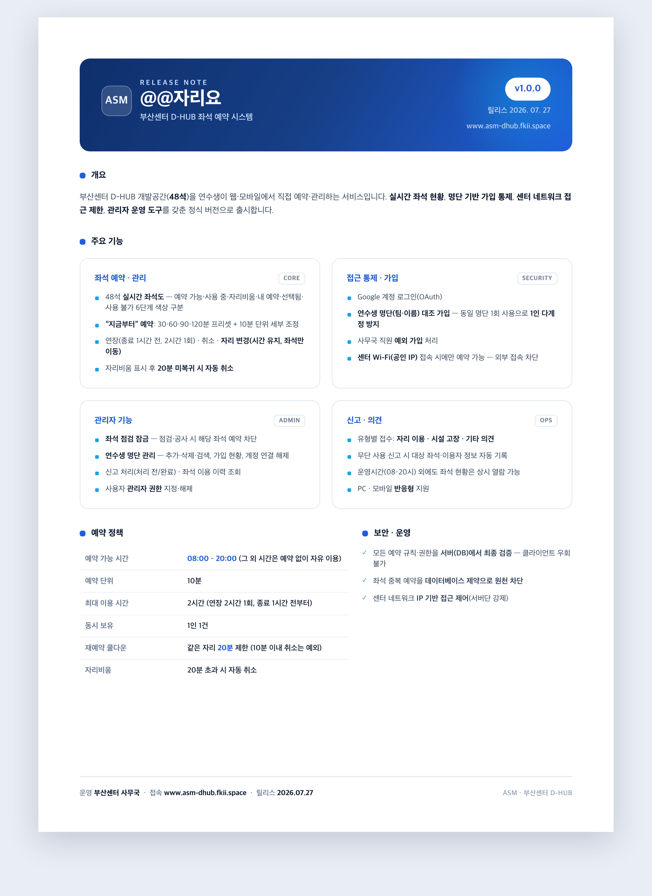

# 부산센터 D-HUB 좌석 예약 (@@자리요)

48석 개발공간(D-HUB)을 예약제로 운영하기 위한 웹앱. PC / 모바일 반응형.

## 릴리스 노트 · v1.0.0

<p align="center">
  
</p>

> 원본 HTML: [`docs/release-note.html`](docs/release-note.html) — 브라우저에서 열어 인쇄(PDF 저장)할 수 있습니다.

## 예약 규칙

| 항목 | 값 |
| --- | --- |
| 운영 | 24시간 개방 · **예약은 08–20시만** (그 외 시간은 예약 없이 자율 이용) |
| 좌석 | 48석 · 3블록 × 2줄 × 8열 (창가 → 출입문) |
| 예약 시작 | **지금부터** — 센터에 와서 예약하는 방식 (미래 시각 예약 없음) |
| 예약 오픈 유예 | 07:30–08:00 사이 예약 시 시작 시각을 08:00으로 당겨 준다 |
| 기본 예약 | 최대 2시간 |
| 연장 | 종료 1시간 전부터, 최대 2시간, **1회만** |
| 한 예약의 최대 길이 | 4시간 (2 + 2). 이후엔 새로 예약 |
| 시간 단위 | 10분 |
| 동시 보유 | 1인 1건 |
| 자리 변경 | 이용 시간은 그대로 두고 **자리만 이동** |
| 재예약 쿨다운 | **같은 자리는 종료·취소 후 20분간 재예약 불가** (10분 이내 취소는 예외). 다른 자리는 즉시 |
| 자리비움 | 20분 안에 복귀하지 않으면 예약 자동 취소 (이후 그 자리 20분 쿨다운) |

규칙은 **전부 DB에 있다.** 앱 코드는 화면을 그릴 뿐이고, 최종 판정은 PostgreSQL이 한다.
`src/lib/policy.ts`의 상수는 화면 표시용 사본이므로, 값을 바꾸면 `supabase/migrations/`의
`policy` 스키마(0001, 0006, 0011, 0014, 0015 …)도 함께 바꿔야 한다.

## 가입 · 접근 제어

| 항목 | 값 |
| --- | --- |
| 로그인 | Google OAuth |
| 가입 통제 | 온보딩의 (팀·이름)을 **연수생 명단(`roster`)과 대조**해야 가입. 명단은 공백·대소문자 무시 매칭 |
| 1인 1계정 | 한 명단 항목은 한 계정에만 연결 → 같은 사람이 다른 구글 계정으로 재가입 불가 |
| 사무국 예외 | 팀명을 **`사무국`**으로 입력하면 명단 없이 가입 (관리자 권한은 자동 부여 안 함) |
| 접속 제한 | `CENTER_IPS`가 설정되면 **센터 와이파이(공인 IP)에서만 예약 가능**. 외부 접속 시 버튼 차단 (서버에서도 강제) |

## 관리자 페이지

`profile.is_admin = true`인 사용자만 접근한다.

- **좌석 점검 잠금** — 특정 좌석을 예약 불가(`seat.active=false`)로 전환/해제. 잠글 때 진행 중·예정 예약은 함께 취소
- **연수생 명단 관리** — 추가·삭제·검색, 가입 현황(가입 계정 이메일), 계정 연결 해제
- **신고 처리** — 유형(자리 이용/시설 고장/기타) 필터, 처리 전/완료 전환
- **사용자 권한** — 관리자 지정/해제
- **좌석 이용 이력** — 좌석별 예약 기록 조회

## 기술 스택

- Next.js 16 (App Router) / React 19 / TypeScript
- Tailwind CSS v4
- Supabase (PostgreSQL + Auth + Realtime)

## 설정

### 1. Supabase 프로젝트

1. [supabase.com](https://supabase.com)에서 프로젝트 생성 (region은 `Northeast Asia (Seoul)` 권장)
2. SQL Editor에서 `supabase/migrations/`의 파일을 **번호 순서대로**(0001 → 0020) 붙여넣고 실행
3. **연수생 명단 적재** — `supabase/dev/roster_seed.sql`(예시)처럼 `roster(team, name)`에 명단을 넣는다.
   명단이 비어 있으면 신규 가입이 전부 막히므로 마이그레이션 직후 바로 넣는다.
4. Settings > API에서 값을 복사해 `.env.local` 작성

```
NEXT_PUBLIC_SUPABASE_URL=https://xxxx.supabase.co
NEXT_PUBLIC_SUPABASE_ANON_KEY=sb_publishable_...
# 센터 와이파이 제한을 켤 때만. 센터 공인 IP를 콤마로 구분. 비우면 제한 꺼짐.
CENTER_IPS=115.22.60.18
```

`service_role`(secret) 키는 넣지 않는다. 브라우저로 새어나가면 RLS가 통째로 무력화된다.
`CENTER_IPS`는 서버 전용(비공개)이며, 배포 환경(Vercel)에서는 환경 변수로 넣고 **저장 후 재배포**해야 반영된다.

### 2. 로그인 방식

Google OAuth (`signInWithOAuth`)를 쓴다. Supabase 대시보드에서:

- Authentication > Providers에서 **Google** 활성화 + OAuth 클라이언트 등록
- Authentication > URL Configuration의 Redirect URLs에 배포 도메인과 `http://localhost:3000/**` 추가

### 3. 자리비움 자동 취소 (선택, 운영 권장)

앱이 열려 있으면 클라이언트가 자리비움 20분 초과 예약을 스스로 취소한다. 앱을 닫아버린
경우까지 확실히 처리하려면 서버에서 주기적으로 쓸어야 한다.

- Database > Extensions에서 `pg_cron` 활성화
- `supabase/migrations/0012_away_autocancel.sql` 실행 후, SQL Editor에서:

```sql
select cron.schedule('cancel-stale-away', '* * * * *', $$ select cancel_stale_away() $$);
```

### 4. 실행

```bash
npm install
npm run dev
```

## 설계 메모

### 겹침은 DB가 막는다

```sql
exclude using gist (seat_id with =, period with &&) where (status = 'active')
```

같은 좌석에 시간이 겹치는 예약은 존재할 수 없다. 두 사람이 같은 순간 같은 좌석을 눌러도,
연장이 뒷사람 예약을 침범해도 트랜잭션 단위로 거부된다.
그래서 `extend_reservation()`에는 겹침 검사 코드가 없다 — 제약이 대신한다.

"빈자리 확인 → 예약" 같은 코드를 앱에 짜면 그 사이에 다른 사람이 끼어드는 틈이 생긴다.
이 방식엔 그 틈이 없다.

### "지금부터 몇 분" 모델

예약은 절대 시각을 고르지 않는다. 시작은 늘 현재 분(초 버림)이고, 이용 시간을 10분 단위로
고른다(`src/components/ReservationPanel.tsx`). 예약이 자정을 넘을 수 없고, 종료 시각이
운영 마감(20:00)에 가까우면 선택할 수 있는 이용 시간이 자연히 줄어든다.

### 개발용 24시간 모드

`.env.local`에 `NEXT_PUBLIC_DEV_HOURS_24=1`을 두면 밤에도 예약을 테스트할 수 있게 운영
시간이 00~24로 열린다. DB 쪽도 `supabase/dev/dev_hours.sql`을 함께 실행해야 하고,
배포 전에는 반드시 08~20으로 되돌린다.

### 명단 대조 방식

온보딩에서 프로필을 바로 넣지 않고 `register_profile(name, team)`(security definer)이 명단과
대조해 통과한 경우에만 프로필을 만들고 그 명단 항목을 계정에 잠근다(`roster.claimed_by`).
매칭은 공백 제거 + 소문자 정규화 키(`roster.norm`)로 하고, 팀명이 `사무국`이면 대조를 건너뛴다.

### 남은 것

- **노쇼 처리** — 예약해놓고 안 온 사람의 좌석. 자리비움 20분 자동 취소로 일부 완화되지만,
  자리비움을 켜지 않은 채 안 오는 경우는 신고로 처리한다.
- **명단 도용** — 이름·팀을 정직하게 입력한다는 전제. 완전 중복(같은 명단 재사용)은 막히지만,
  미가입자의 이름·팀을 알고 선점하는 것까지는 막지 않는다.
- **알림** — 자리비움 임박·자동 취소 등을 푸시/메일로 알리는 기능은 아직 없다.
